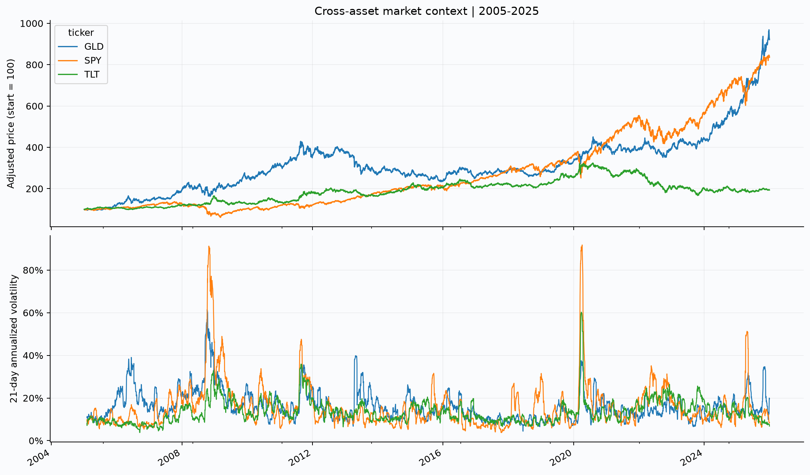
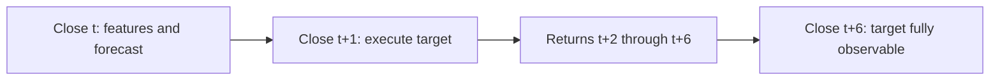
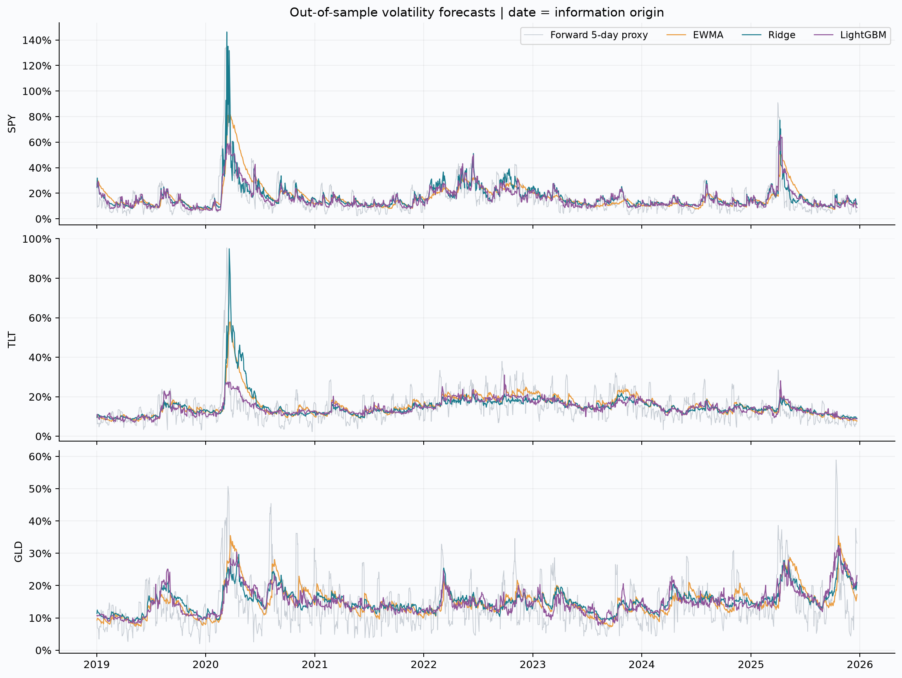
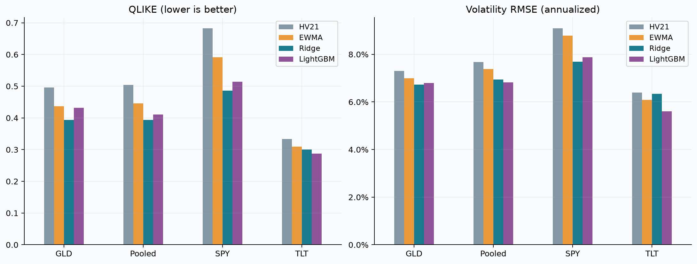
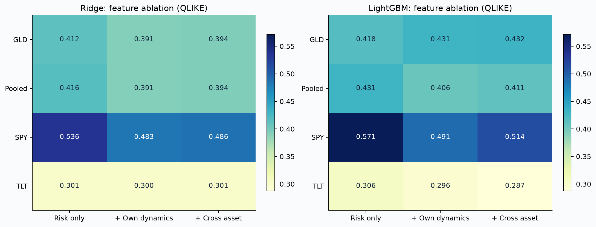
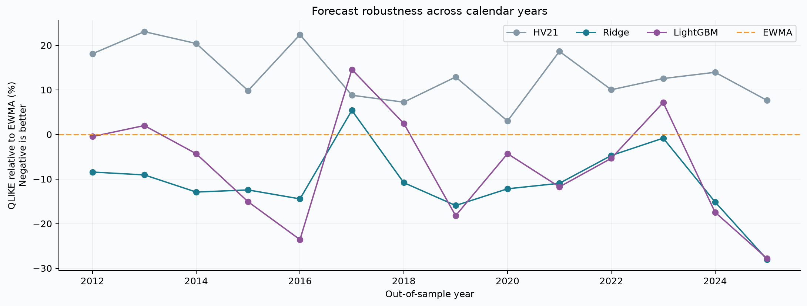
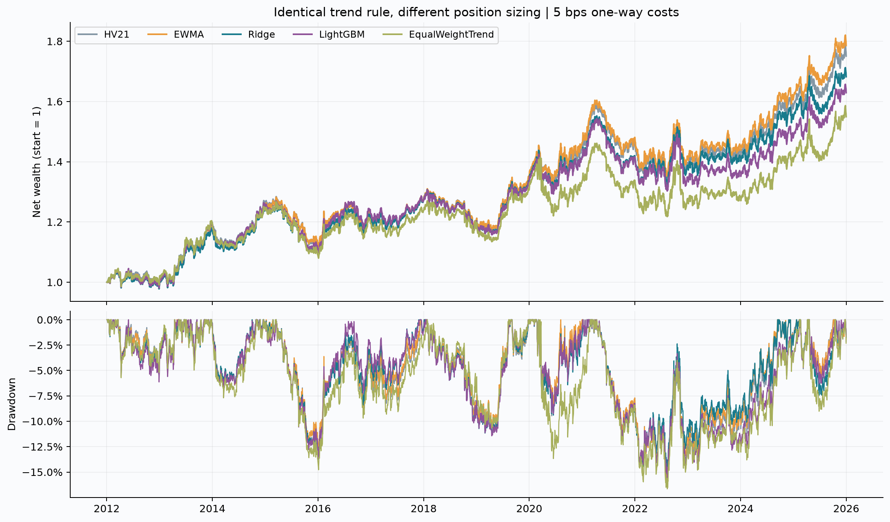
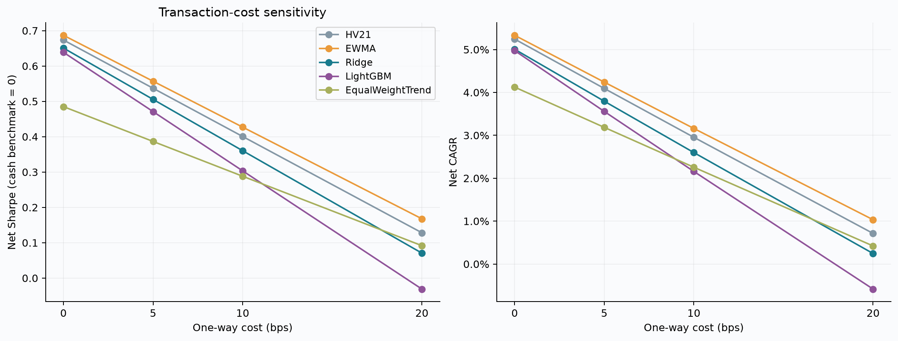
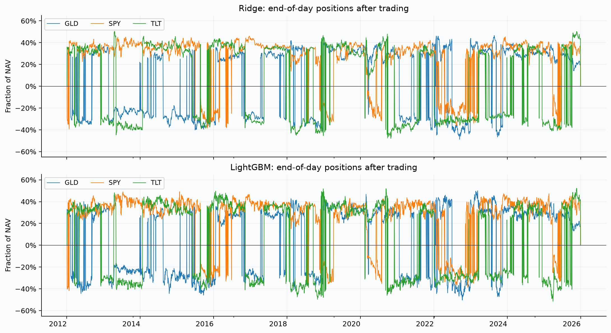
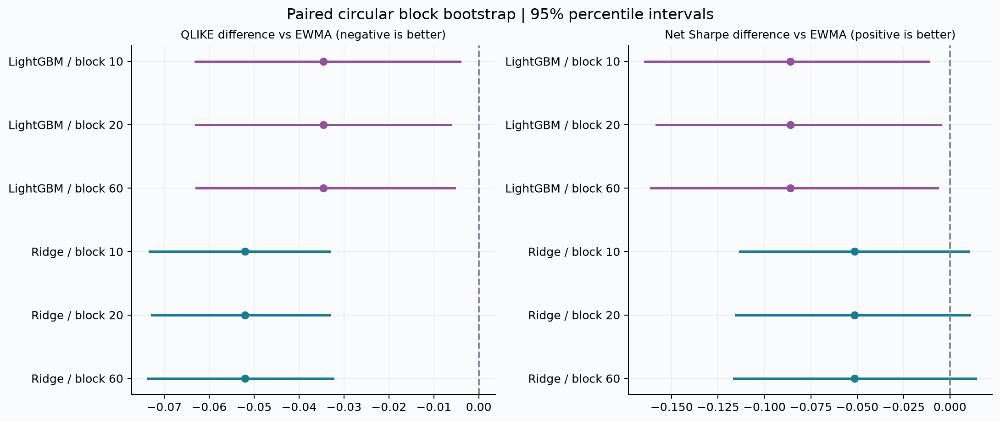

# Machine Learning for Cross-Asset Volatility Forecasting and Portfolio Allocation

A reproducible research project asking whether better volatility forecasts lead
to better portfolio decisions. Daily SPY, TLT and GLD data; Ridge and LightGBM;
historical-volatility and EWMA benchmarks; purged walk-forward validation;
transaction costs, feature ablations and paired block-bootstrap inference.

**Status:** implemented and evaluated on real historical data. This is a research
backtest, not a live trading system.
[Run instruction](#reproduce) ·
[数据说明](#data-provenance) · [工程接口](#implementation-contract) ·
[简历与面试准备](#career-notes)

## What the experiment found

2005–2025 price history; 14 annual out-of-sample folds from 2012 through 2025;
3,514 common forecast origins per asset. The forecast target is five-day
annualized variance after a one-day execution delay.

| Method (ML: full features) | Pooled QLIKE ↓ | Improvement vs EWMA | Net Sharpe¹ | Max drawdown¹ | Annual turnover¹ |
|---|---:|---:|---:|---:|---:|
| HV21 | 0.5041 | −13.13% | 0.537 | −16.17% | 22.00× |
| EWMA | 0.4456 | — | **0.557** | −15.74% | **20.83×** |
| Ridge | **0.3936** | **11.67%** | 0.506 | **−14.86%** | 23.20× |
| LightGBM | 0.4110 | 7.76% | 0.471 | −15.55% | 27.20× |

¹ Same 126-day trend signal, 5 bps one-way transaction costs, 50 bps annual short
borrow cost, zero cash-return benchmark. Turnover sums absolute traded notional
and is not divided by two. All forecasts share the same dates.

Both ML methods improve QLIKE relative to EWMA under the primary 20-day paired
block bootstrap (Holm-adjusted p = 0.0010 and 0.0180). **Neither improves the
strategy's net Sharpe.** Ridge's Sharpe-difference interval includes zero;
LightGBM's is below zero. Adding other assets' features also does not improve
pooled QLIKE over the own-asset feature set in this experiment. These results
separate statistical forecast accuracy from economic value.

## Reproduce

Python 3.13 is the recorded environment. Run commands from the repository root.
The first run requires internet access; later runs can use the verified cache.

```bash
python3 -m venv .venv
source .venv/bin/activate
python -m pip install -r requirements-lock.txt
python -m pip install -e . --no-deps

# macOS only, if LightGBM cannot load its OpenMP runtime:
# brew install libomp

crossvol run                       # download, fit, backtest, infer, plot, report
crossvol run --offline             # rerun from the same SHA-256-verified snapshot
crossvol run --offline --reuse-forecasts  # checked code/config/data/output hashes
crossvol report                    # refresh figures and the research section in README
pytest -q
ruff check src tests scripts
python scripts/verify_artifacts.py  # verify source/data/output hashes and accounting
```

The complete default experiment took about 45 seconds on the development
machine; runtime depends on hardware. Models use one LightGBM thread. The exact
dependency versions, source hashes, configuration and input/output hashes are in
[the run manifest](artifacts/run_manifest.json). Re-downloading provider data may
return revisions; preserve the local snapshot and its metadata for identical
inputs. `--refresh` explicitly replaces the snapshot.

## Research design

- **Timing:** features observed at close `t`; orders execute at close `t+1`;
  returns begin at `t+2`. The label uses squared log returns `t+2 … t+6`.
- **Validation:** annually expanding outer training; two chronological 126-day
  inner validation blocks; label-end purging at every boundary. Three fixed
  candidate configurations per model, no test-period model selection.
- **Features:** historical risk (4), own-asset dynamics (14), cross-asset inputs
  (20 active features). Self cross channels are zero, avoiding duplicated Ridge
  predictors in the ablation.
- **Models:** separate asset-specific Ridge and LightGBM log-variance models with
  training-only smearing; fixed HV21 and EWMA benchmarks. Full models remain the
  primary comparison regardless of ablation outcomes.
- **Portfolio:** common trend direction, inverse-volatility sizing, asset/gross
  limits, drift-aware turnover, self-financing transaction costs, borrow charges,
  entry fees and final liquidation. Equal-weight trend is an additional control.
- **Inference:** synchronized circular blocks across dates, assets and methods;
  2,000 replicates at block lengths 10/20/60; paired loss and Sharpe differences;
  Holm correction for the two primary forecast comparisons per block length.

## Repository map

```text
configs/default.yaml          Frozen research parameters
src/crossvol/
  data.py                     Download, validate and hash adjusted prices
  features.py                 Causal features and delayed forward labels
  walkforward.py              Nested tuning, purging and annual forecasts
  portfolio.py                Self-financing daily portfolio accounting
  statistics.py               Metrics and paired block-bootstrap inference
  plots.py                    Nine figures, PNG and SVG
  report.py                   Refresh the generated research section in README
  cli.py                      Reproducible command-line workflow
tests/                        Offline synthetic integrity and regression tests
artifacts/
  figures/                    Market, forecast, ablation, strategy and inference plots
  tables/                     Metrics, inference and locally generated audit tables
  run_manifest.json           Configuration, versions and hashes
README.md                    Project guide, full research report and career notes
scripts/verify_artifacts.py   Verify source/data/result hashes and accounting identities
```

Raw provider prices and large daily/audit CSVs are kept locally and excluded
from Git. The smaller summary tables and figures are included for review.
Running the pipeline regenerates `predictions.csv`, `folds.csv`, `tuning.csv`,
`importance.csv`, `daily.csv` and `weights.csv`. The [data notes](#data-provenance)
explain cache integrity and provider-data redistribution.

## Interpretation limits

The ETF universe is small and chosen retrospectively. Adjusted Yahoo prices are
not point-in-time data or executable quotes. Squared daily returns are a noisy
volatility proxy. The 10% risk budget is not a guaranteed portfolio volatility
target; the allocation omits covariance modeling. Cash earns zero and Sharpe
does not subtract a historical risk-free series. Borrow availability, margin
rules, market impact, capacity and taxes are not modeled. Bootstrap inference
is conditional on fitted forecasts and does not absorb all research selection.
The rolling test years have been examined; there is no untouched final holdout.

Code is [MIT-licensed](LICENSE); third-party data is not covered by that license.

`crossvol run` and `crossvol report` update only the marked research section
below. The project overview and appendices remain editable and are preserved.
Do not remove the generated-section markers.

<!-- BEGIN GENERATED RESEARCH -->

<a id="research-report"></a>

## 中文研究报告

**独立量化研究项目｜已实现并完成历史样本外实验｜研究版 v0.1**

本报告由 `crossvol run` 从实际 CSV 结果自动生成；修改数据或参数后应完整重跑，不手工填写绩效。生成时间：2026-09-24T07:42:57.530409+00:00。研究目的：检验机器学习能否改善跨资产波动率预测，以及预测是否能改善相同趋势信号下的仓位配置。所有结果均为历史模拟。

### 1. 核心结果与研究判断

- **Ridge full**：汇总 QLIKE 为 0.3936，相对 EWMA 降低 11.67%；主 block 检验的 Holm p=0.0010。5 bps 下净 Sharpe 为 0.506，相对 EWMA 的差异为 -0.051，95% CI [-0.115, 0.011]。
- **LightGBM full**：汇总 QLIKE 为 0.4110，相对 EWMA 降低 7.76%；主 block 检验的 Holm p=0.0180。5 bps 下净 Sharpe 为 0.471，相对 EWMA 的差异为 -0.086，95% CI [-0.158, -0.005]。

在预先固定的主比较中，2 个 ML 模型相对 EWMA 的 QLIKE 改善通过 5% Holm 校正检验。 Ridge 的 Sharpe 差异区间覆盖零，不能证明其优于 EWMA。 LightGBM 的 Sharpe 差异区间完全低于零，支持其在本实验条件下劣于 EWMA。

本项目的可展示价值是可审计的样本外研究链条：真实数据、严格时间边界、基准对照、有限调参、消融、真实持仓会计和依赖结构下的推断。预测误差、组合收益与统计显著性分别报告；不预设复杂模型一定获胜。

### 2. 数据、范围与可复现性

| 项目 | 实际设置 |
|---|---|
| 标的 | SPY（美国股票）、TLT（长期美国国债）、GLD（黄金） |
| 原始数据 | Yahoo Finance 经 yfinance 下载的日频 OHLCV；auto_adjust=True，repair=False |
| 价格范围 | 2005-01-03 至 2025-12-31，5,283 个交易日、15,849 行 |
| 预测样本外 origin | 2012-01-03 至 2025-12-22，3,514 个共同 origin |
| 组合回测日期 | 2012-01-03 至 2025-12-31（起始全现金锚点不进入收益矩） |
| 外层 / 内层 | 14 个年度外层折；每折 2 个 126 日验证块 |
| 数据下载时间 UTC | 2026-09-24T04:51:46.081598+00:00 |
| 随机种子 / 年化 | 42 / 252 |
| 数据质量 | 共同交易日缺失 0，重复 0，零成交量 0 |

数据包含 2 个超过4个自然日的相邻日期间隔；不将周末、节假日和停市自动填成零收益。校验还检查 OHLC 正值、价格上下界、共同日期以及异常日收益。没有用模拟数据替代真实行情。

数据 SHA-256：`9c25d50739b325ed69f660fef286de0ae9c2f00d399806ac20d46cd84ea8f3eb`。完整下载参数见 [data_manifest.json](artifacts/data_manifest.json)；配置、包版本、源码及结果哈希见 [run_manifest.json](artifacts/run_manifest.json)。缓存读取先校验哈希，线上数据修订必须显式 `--refresh`；首次运行也从落盘快照重新读入，避免序列化前后差异。

价格用拆股和分红复权后的序列计算收益。复权价格是总回报近似，不是当日可直接成交的报价；空头的分红负担相应体现在总回报方向中。Yahoo 快照不是历史时点版本数据库，不能声称消除了所有供应商修订问题。数据接口参数以 [yfinance 官方说明](https://ranaroussi.github.io/yfinance/reference/api/yfinance.download.html) 为准。



### 3. 目标变量与执行时间：先定义可用信息

令 $P_{i,t}$ 为资产 $i$ 在交易日 $t$ 的复权收盘价，$r_{i,t}=\log(P_{i,t}/P_{i,t-1})$。在 $t$ 日收盘后形成特征和预测；$t+1$ 收盘执行；新仓位从 $t+2$ 日的 close-to-close 收益开始获利或亏损。

默认 $h=5$、成交延迟 $d=1$：

$$y_{i,t} = \frac{252}{5}\sum_{k=2}^{6}r_{i,t+k}^2,\qquad \sigma^{realized}_{i,t}=\sqrt{y_{i,t}}.$$

这是未来5个交易日的**平方日收益波动率代理**，没有减去样本均值；不是高频 realized variance，也不是可直接观测的潜在条件方差。标签最后需要 $t+6$ 的价格，因此 `label_end=t+6`，最后6个 origin 无完整标签，全部从预测评分中排除。



特征只使用 origin 及此前数据。用特征时间戳过滤训练集还不够；训练时同时要求 `label_end < next_boundary`。组合用简单收益 $P_t/P_{t-1}-1$ 做精确净值递推，不把对数收益直接当作资金收益。

### 4. 特征、模型与有限调参

| 组别        |   有效特征数 | 内容                                            |
|:----------|--------:|:----------------------------------------------|
| risk_only |       4 | log RV(5/21/63), log EWMA                     |
| no_cross  |      14 | risk_only + 本资产收益、下行风险、波动变化、回撤、Parkinson 区间波动 |
| full      |      20 | no_cross + 另外两类资产各3项：log RV21、5日收益、63日相关性     |

no_cross 的具体扩展项：1/5/21/63日累计对数收益、当日绝对收益、21日下行平方收益均值的对数、RV5/RV63、21日历史波动率序列的21日标准差、63日回撤、21日 Parkinson 高低价区间波动率的对数。特征定义均在 [features.py](src/crossvol/features.py)。

full 在代码中使用23列统一 schema；其中本资产的3个 cross 通道固定为零，每个模型有20项有效特征。这样避免重复本资产特征改变 Ridge 的有效 L2 惩罚，使 full/no_cross 更清楚地比较其它资产的信息。full 与 no_cross 各自仅在内层选择超参数；比较衡量整个受控训练流程的差异，不能把差异解释为某单一特征的因果贡献。

| 模型 | 拟合目标与设置 | 超参数候选 |
|---|---|---|
| HV21 | 最近21日平方收益均值 ×252 | 固定21日，无样本外调参 |
| EWMA | $v_t=0.94v_{t-1}+0.06r_t^2$，年化后预测未来方差；至少63日预热 | 固定 λ=0.94 |
| Ridge | StandardScaler + L2 线性回归，拟合 log 方差 | α=[0.1, 10.0, 1000.0] |
| LightGBM | 浅树梯度提升，平方误差拟合 log 方差，learning_rate=0.05 | 3个固定组合，见下表 |

|   n_estimators |   num_leaves |   min_child_samples |   reg_lambda |
|---------------:|-------------:|--------------------:|-------------:|
|       100.0000 |       7.0000 |             40.0000 |       1.0000 |
|       200.0000 |       7.0000 |             80.0000 |       5.0000 |
|       150.0000 |      15.0000 |             80.0000 |      10.0000 |

每个资产分别拟合；“跨资产”指输入其它资产风险状态，不是把三只 ETF 的样本行随机混合。两类 ML 使用相同的候选数及验证时间预算，不做大规模搜索，不用测试集早停。Ridge 的缩放器仅在每个训练折拟合。LightGBM 固定随机种子、单线程、`deterministic=True`、`force_col_wise=True`，但跨平台或库版本仍可能存在差异，参见 [LightGBM 官方参数](https://lightgbm.readthedocs.io/en/stable/Parameters.html)。

为把 log 预测转换为算术方差，使用训练残差 smearing 因子：

$$\widehat y_t=\exp(\widehat f(X_t))\times\frac1n\sum_{j\in train}\exp(\log y_j-\widehat f(X_j)).$$

因子从当前拟合的训练残差估计，不读取验证或测试标签。全局 smearing 只是偏差修正近似，无法保证所有条件状态下的方差校准；树模型的训练内残差可能低估样本外残差分布。所有预测统一截断在 $[10^{-8},4]$ 年化方差内；这些固定数值保护不根据测试结果选择。

### 5. 嵌套 walk-forward 与防泄漏审计

每年年初进行一次模型重估和内层调参，该年预测使用固定参数和当日可得特征。历史训练集逐年扩展。以前年度的测试标签在实际时间上完整可得后，可以进入后续年度训练；这符合在线研究的时间顺序。首个外层训练 origin 为 2005-04-05 至 2011-12-21，其最大标签终点为 2011-12-30，严格早于测试开始 2012-01-03。

1. 对测试年度边界 $T$，仅允许 origin $<T$ 且 `label_end < T` 的训练样本。
2. 从可用历史中向前构造2个126日验证块；每个训练/验证边界同样按标签终点清除重叠，验证标签还必须早于下一块/测试边界。默认等价于边界前6个 origin 被剔除。
3. 每个候选在全部验证块上计算 QLIKE，取等权平均最低者；不查看外层测试成绩。
4. 用选中配置重新拟合所有当时可用训练数据，预测该年度；保存每个候选、训练区间、验证区间、所选参数及 smearing。
5. 所有模型、资产和消融组使用完全相同的有效预测日期。累计生成 84,336 条预测、252 个 ML 外层拟合及 1512 条候选/验证审计记录。

`folds.csv` / `tuning.csv` 可逐行检查 `train_max_label_end < validation_start/test_start`。这种设计与 [scikit-learn 时间序列验证的时间顺序及 gap 原则](https://scikit-learn.org/stable/modules/generated/sklearn.model_selection.TimeSeriesSplit.html) 一致，本项目另外显式使用标签终点做 purge。

当前样本外定义是**相对每次模型拟合的时间样本外**。研究者已查看整个实验输出，2023–2025 年也属于滚动实验，不声称是永久锁定、从未看过的最终 holdout。继续尝试新方法会增加研究者选择偏差；后续确认应另锁定新的未来区间。

### 6. 预测评分与实际结果

主评分使用方差的 QLIKE：

$$L(y,\widehat y)=\frac{y}{\widehat y}-\log\left(\frac{y}{\widehat y}\right)-1.$$

越低越好；同时报告年化波动率 RMSE/MAE 以及 `mean(target variance)/mean(predicted variance)` 校准比，理想为1。Pooled 对同一天资产等权，再对日期等权；不把三倍资产行数误当成独立样本量。选择 QLIKE 的动机来自 [Patton (2011) 关于噪声波动率代理下预测比较的研究](https://public.econ.duke.edu/~ap172/Patton_robust_JoE_forthcoming.pdf)；其稳健性依赖代理和条件假设，不能自动解释成真实潜在波动率的无偏排名。

| ticker   | model    |   qlike |   vol_rmse |   vol_mae |   calibration |
|:---------|:---------|--------:|-----------:|----------:|--------------:|
| GLD      | EWMA     |  0.4365 |     0.0700 |    0.0500 |        0.9977 |
| SPY      | EWMA     |  0.5911 |     0.0879 |    0.0564 |        0.9936 |
| TLT      | EWMA     |  0.3091 |     0.0609 |    0.0411 |        0.9916 |
| Pooled   | EWMA     |  0.4456 |     0.0738 |    0.0492 |        0.9943 |
| GLD      | HV21     |  0.4963 |     0.0731 |    0.0517 |        0.9978 |
| SPY      | HV21     |  0.6826 |     0.0909 |    0.0568 |        0.9970 |
| TLT      | HV21     |  0.3333 |     0.0639 |    0.0420 |        0.9944 |
| Pooled   | HV21     |  0.5041 |     0.0768 |    0.0502 |        0.9965 |
| GLD      | LightGBM |  0.4318 |     0.0679 |    0.0501 |        0.9907 |
| SPY      | LightGBM |  0.5137 |     0.0788 |    0.0512 |        1.0856 |
| TLT      | LightGBM |  0.2875 |     0.0560 |    0.0386 |        1.1292 |
| Pooled   | LightGBM |  0.4110 |     0.0682 |    0.0466 |        1.0645 |
| GLD      | Ridge    |  0.3938 |     0.0673 |    0.0501 |        0.9687 |
| SPY      | Ridge    |  0.4864 |     0.0769 |    0.0512 |        0.9574 |
| TLT      | Ridge    |  0.3006 |     0.0634 |    0.0416 |        0.9822 |
| Pooled   | Ridge    |  0.3936 |     0.0694 |    0.0477 |        0.9682 |

RMSE/MAE 以小数年化波动率为单位，0.01=1个百分点。预测图仅截取2019年以后便于阅读；指标使用完整样本外区间。





### 7. 特征消融与年度稳定性

| model    | feature_set   |   qlike |   vol_rmse |   calibration |
|:---------|:--------------|--------:|-----------:|--------------:|
| LightGBM | full          |  0.4110 |     0.0682 |        1.0645 |
| LightGBM | no_cross      |  0.4059 |     0.0681 |        1.0391 |
| LightGBM | risk_only     |  0.4315 |     0.0726 |        0.9639 |
| Ridge    | full          |  0.3936 |     0.0694 |        0.9682 |
| Ridge    | no_cross      |  0.3912 |     0.0698 |        0.9687 |
| Ridge    | risk_only     |  0.4163 |     0.0719 |        0.9551 |

Ridge 的 full 相对 no_cross QLIKE 变化为 +0.60%，三组中 no_cross 的点估计最低。 LightGBM 的 full 相对 no_cross QLIKE 变化为 +1.26%，三组中 no_cross 的点估计最低。 这些是完整样本外结果的描述性比较；没有据此替换 full 主模型，也未为全部消融比较提供多重检验后的显著性结论。训练期特征重要性保存在 `importance.csv`：Ridge 为标准化系数绝对值，LightGBM 为 gain；均不是因果解释，也不是额外的样本外证据。





年度图与 [yearly_forecast_metrics.csv](artifacts/tables/yearly_forecast_metrics.csv) 用于检查平均值是否由少数年份驱动。疫情、通胀及利率变化属于解释背景，未作为事后筛选“好年份”的规则。

### 8. 趋势策略与仓位会计

固定趋势方向：$s_{i,t}=\operatorname{sign}(P_{i,t}/P_{i,t-126}-1)$。该规则只隔离波动率预测的仓位作用，不训练收益方向模型。它借鉴时间序列趋势思想，但不是 [Moskowitz, Ooi & Pedersen (2012)](https://www.aqr.com/Insights/Research/Journal-Article/Time-Series-Momentum) 的12个月期货策略复现。

$$\widetilde w_{i,t}=s_{i,t}\frac{0.10}{\sqrt{3}\max(\widehat\sigma_{i,t},0.05)}.$$

先将每个资产权重限制为 ±60%，再按比例缩放使总绝对权重不超过 100%。10% 是忽略相关性的等风险预算参数，截断和相关性意味着实际组合波动率**不保证为10%**。上限在成交时施加；两次成交之间及最后尾部持仓可因价格漂移越界。EqualWeightTrend 使用同一趋势方向，方向非零时各资产绝对权重1/3，方向恰为零则空仓，作为不用动态波动率预测的控制组。

这是用五日平均方差预测作为每日仓位的平滑风险估计，不声称它已经被验证为下一日条件方差预测。每天按实际持仓更新损益，再成交；交易量来自目标与**漂移后**持仓之差。为避免“先用全额资金买入、再扣费”造成隐性杠杆，用以下自融资方程求扣费后 NAV 比例 $z$：

$$z=1-c\sum_i|z w_i^*-w_i^-|,$$

其中 $w^-$ 用交易前 NAV 计量，$w^*$ 用交易后 NAV 计量，$c=\mathrm{bps}/10000$。首次入场及最终平仓都收费，单边换手为全部买卖绝对金额之和 / 交易前 NAV，不再除以2。持仓做空时，每年 50 bps 借券费按前一日空头名义额每日计提。组合现金收益假设为0，未额外采用真实无风险利率序列；本报告 Sharpe 是以零现金收益为基准的扣费后 Sharpe。

预测 origin 最后一天为 2025-12-22，最后目标延迟一天执行，之后不人为生成新预测、不重复调仓，持仓自然漂移至最后标签终点后平仓。因此尾部仍有价格收益，但没有不完整标签的预测评分。

净收益包含总回报价格损益、借券费及交易费。默认成本情景为 [0, 5, 10, 20] bps；**0 bps 只代表零交易费，仍收借券费**。未另计资金规模相关市场冲击、税费、ETF 冲击成本非线性、卖空可得性和保证金分账。复权收盘价与常数成本是研究简化，不代表成交仿真。

### 9. 组合表现、成本与阶段结果

基准情景：5 bps 单边交易费 + 50 bps 年化借券费。

| model            | CAGR   | 年化波动   |   净 Sharpe | 最大回撤    |   年化单边换手倍数 | 平均总敞口   |
|:-----------------|:-------|:-------|-----------:|:--------|-----------:|:--------|
| HV21             | 4.09%  | 8.08%  |      0.537 | -16.17% |     21.998 | 97.98%  |
| EWMA             | 4.24%  | 8.04%  |      0.557 | -15.74% |     20.834 | 97.89%  |
| Ridge            | 3.79%  | 8.00%  |      0.506 | -14.86% |     23.199 | 98.25%  |
| LightGBM         | 3.56%  | 8.12%  |      0.471 | -15.55% |     27.203 | 98.51%  |
| EqualWeightTrend | 3.19%  | 9.21%  |      0.387 | -16.66% |     18.100 | 99.95%  |

CAGR 按252交易日年化；Sharpe 为日均净收益 / 日收益标准差 ×√252；最大回撤相对历史净值高点；年化单边换手倍数包含入场和平仓。`total_cost` 在 CSV 中为每日归一化费用拖累的加总，不等于终值财富损失。完整情景见 [portfolio_metrics.csv](artifacts/tables/portfolio_metrics.csv)。





下表为固定连续区间的净 Sharpe 描述性拆分；沿用完整回测持仓，区间边界不额外清仓，不是重新调参的子策略。

| model            |   2012–2016 |   2017–2021 |   2022–2025 |
|:-----------------|------------:|------------:|------------:|
| EWMA             |       0.563 |       0.553 |       0.561 |
| EqualWeightTrend |       0.480 |       0.288 |       0.412 |
| HV21             |       0.557 |       0.531 |       0.528 |
| LightGBM         |       0.572 |       0.412 |       0.431 |
| Ridge            |       0.534 |       0.473 |       0.515 |



### 10. 保留时间依赖的 block-bootstrap 推断

重叠5日标签使损失存在序列相关；多个资产同日也相关。本项目使用**配对 circular block bootstrap**：对共同日期抽取连续区块并允许末尾环绕，所有资产与模型共享同一抽样日期，先在资产间等权，再比较模型，不能把每个资产独立重采样。方法背景可见 [arch 的时间序列 bootstrap 说明](https://arch.readthedocs.io/en/stable/bootstrap/timeseries-bootstraps.html)，本仓库直接用 NumPy 实现。

固定 2,000 次重采样，block 长度 [10, 20, 60]，预设主长度 20。波动率比较统计量是 `mean(QLIKE_model − QLIKE_EWMA)`，负值更好。报告95% percentile CI；检验用居中到零假设的 bootstrap 分布计算双侧 p，并在同一长度下对 Ridge/LightGBM 两项比较做 Holm 校正。不同 block 是稳健性分析，不能事后选择显著的一档。CI 本身不是同时置信区间。

| model    |   block_length |   estimate |   ci_low |   ci_high |   p_value |   p_holm |
|:---------|---------------:|-----------:|---------:|----------:|----------:|---------:|
| Ridge    |             10 |    -0.0520 |  -0.0733 |   -0.0331 |    0.0005 |   0.0010 |
| LightGBM |             10 |    -0.0346 |  -0.0631 |   -0.0041 |    0.0230 |   0.0230 |
| Ridge    |             20 |    -0.0520 |  -0.0727 |   -0.0332 |    0.0005 |   0.0010 |
| LightGBM |             20 |    -0.0346 |  -0.0629 |   -0.0063 |    0.0180 |   0.0180 |
| Ridge    |             60 |    -0.0520 |  -0.0736 |   -0.0324 |    0.0005 |   0.0010 |
| LightGBM |             60 |    -0.0346 |  -0.0629 |   -0.0054 |    0.0190 |   0.0190 |

策略推断在 5 bps 净收益的相同日期上配对抽样，排除起始人为全现金锚点，重算 Sharpe_model − Sharpe_EWMA。报告 percentile CI；不把普通 bootstrap 的正负比例包装为正式显著性 p 值。

| model    |   block_length |   estimate |   ci_low |   ci_high |
|:---------|---------------:|-----------:|---------:|----------:|
| Ridge    |             10 |    -0.0514 |  -0.1132 |    0.0099 |
| LightGBM |             10 |    -0.0860 |  -0.1644 |   -0.0113 |
| Ridge    |             20 |    -0.0514 |  -0.1154 |    0.0106 |
| LightGBM |             20 |    -0.0860 |  -0.1582 |   -0.0048 |
| Ridge    |             60 |    -0.0514 |  -0.1165 |    0.0139 |
| LightGBM |             60 |    -0.0860 |  -0.1611 |   -0.0066 |



区块推断只近似处理一定长度内的依赖；全样本结构变化可能破坏平稳性。区间以本次已拟合预测、既定数据和规则为条件，不重新训练模型，不覆盖模型选择、数据供应商误差及所有研究者尝试的不确定性。Holm 只覆盖上述预设两模型主比较，未覆盖消融、年份及其它潜在尝试。

### 11. 结论、局限与下一步

在预先固定的主比较中，2 个 ML 模型相对 EWMA 的 QLIKE 改善通过 5% Holm 校正检验。 Ridge 的 Sharpe 差异区间覆盖零，不能证明其优于 EWMA。 LightGBM 的 Sharpe 差异区间完全低于零，支持其在本实验条件下劣于 EWMA。 Ridge 的 full 相对 no_cross QLIKE 变化为 +0.60%，三组中 no_cross 的点估计最低。 LightGBM 的 full 相对 no_cross QLIKE 变化为 +1.26%，三组中 no_cross 的点估计最低。

预测误差较低并不必然增加策略 Sharpe。以本次结果为例，5 bps 下 EWMA / Ridge / LightGBM 的年化单边换手分别为 20.83 / 23.20 / 27.20 倍；更复杂的预测未自动带来较低交易频率。0 bps 情景仍可检查不含交易费的相对表现，从而避免把所有差异都归因于成本。固定趋势方向、风险预算截断、相关性变化、预测与持有期的匹配也会影响经济结果；这些机制在本实验中没有被单独做因果识别。比较模型时应同时看 QLIKE、校准、分资产/分年稳定性、回撤和成本后收益，不依据净值最高的一条曲线宣布成功。

本实验的主要边界如下：

- 仅三个事后确定的高流动性存续 ETF，无法推广到整个股票、债券及商品市场；TLT 代表长期国债风险，不是所有 Treasury 久期。
- Yahoo 复权日线缺乏历史时点版本与日内成交细节；日收益平方标签噪声大。Parkinson 特征受跳跃和隔夜信息未纳入区间的影响。
- 参数每年更新一次，强突变期可能滞后；log 回归 + 全局 smearing 的均值修正不保证条件校准。没有额外加入 GARCH/HAR 作为更强结构基准，HV21/EWMA 仅是本版基准集合。
- 现金收益假设0，净 Sharpe 未扣真实逐日无风险利率；借券费固定，不含保证金、可借约束、冲击与容量。该简化会影响收益水平及不同现金/空头比例策略之间的比较。
- 10% 是仓位预算参数；没有显式估计组合协方差，也没有承诺实现某一目标波动。交易费和隔夜执行模型不能替代真实订单仿真。
- 没有永久锁定的独立最终 holdout；所有现有样本外图表都已公开检查。Bootstrap 不是对未来盈利的保证。

后续有价值的扩展是：在新的未见区间先冻结实验计划；加入不同久期债券和更多资产；用有许可证、可追溯的历史版本数据及日内 realized variance；比较 HAR/GARCH；使用训练期残差的时间样本外校准；加入现金利率、真实借券与冲击估计；再检验协方差感知的组合风险配置。扩展应逐项验证，不能持续搜索直至找到显著结果。

### 12. 工程验证与运行方法

测试覆盖以下失效模式：未来价格扰动改变过去特征、标签错位、标签边界重叠、测试标签影响模型选择、缩放器使用测试数据、模型随机性、样本不一致、成交日期提前、忽略漂移换手、入场/平仓漏费、卖空费用漏计、净值不自融资、把资产复制当作更多独立样本、Bootstrap 不配对、以及 Sharpe 锚点口径不一致。网络下载不进入 CI 的单元测试。

```bash
python3 -m venv .venv
source .venv/bin/activate
python -m pip install -r requirements-lock.txt
python -m pip install -e . --no-deps
# macOS LightGBM 若缺少 OpenMP: brew install libomp
crossvol run                   # 首次下载并完整运行
crossvol run --offline         # 使用经过 SHA-256 校验的同一数据快照
crossvol run --offline --reuse-forecasts  # 仅当代码/配置/数据和预测文件哈希匹配
crossvol report                # 从已有结果重建图表及此报告
pytest -q
ruff check src tests scripts
python scripts/verify_artifacts.py
```

原始行情和大体积逐日输出保存在本地并默认不入 Git；汇总表、PNG/SVG 图、配置、清单和本报告可作为 GitHub 展示材料。数据源的使用和再分发条款独立于本仓库代码许可证；复现下载可能受到服务限流与数据修订影响。固定本地快照可以精确重跑本次数据，重新下载只保证方法可复现，不能保证未来供应商返回的价格完全一致。

关键入口：[特征](src/crossvol/features.py) · [Walk-forward](src/crossvol/walkforward.py) · [组合会计](src/crossvol/portfolio.py) · [统计推断](src/crossvol/statistics.py) · [运行入口](src/crossvol/cli.py)。

<!-- END GENERATED RESEARCH -->

<a id="data-provenance"></a>

## Data provenance

The default run downloads daily SPY, TLT and GLD OHLCV from Yahoo Finance through
yfinance, from 2005-01-01 inclusive to 2026-01-01 exclusive. Adjusted OHLC uses
`auto_adjust=True`; `repair=False`. There is no synthetic fallback.

`data/raw/prices.csv` and `data/raw/prices.metadata.json` are a local snapshot and provenance
record. They are deliberately ignored by Git. The first and later runs both read
the serialized CSV. Cache reuse checks request parameters and SHA-256; mismatch
fails with an actionable error. `crossvol run --refresh` explicitly replaces it.
Back up this pair to reproduce the identical price snapshot on another machine.

The public research metadata lives in `artifacts/data_manifest.json`. Raw provider
data is not licensed under the repository's code license. Consult the provider's
terms before redistributing data. Downloading the same dates later may return
revised values, so fresh-download and fixed-snapshot reproducibility differ.

Validation rejects missing assets, unequal dates, duplicates, nonfinite or
nonpositive prices, invalid OHLC bounds, negative volume and extreme daily jumps.
No calendar forward filling is performed. Adjusted data is not a point-in-time
vendor database; the three surviving ETFs are an ex-post chosen universe.

<a id="implementation-contract"></a>

## Implementation contract

This section records the interface and research decisions shared by the implementation modules.

- Config is a nested dict loaded from `configs/default.yaml`.
- Prices: long DataFrame, columns `date,ticker,open,high,low,close,volume`, sorted date/ticker. All OHLC are dividend/split adjusted by yfinance auto_adjust=True. Dates timezone naive.
- Returns for labels/features are adjusted-close log returns. Portfolio earns simple adjusted-close returns.
- Feature origin `t` sees close t. Execution is close t+1; first earned return is t+2. Five-day annualized variance label is 252/5 * sum(log_return[t+2:t+7]**2). `label_end` is t+6. Last 6 rows have missing labels.
- `features.py` implements `features.build_features(prices, config)` returning `(panels, groups)`: `panels` dict ticker -> DataFrame indexed date, all causal features plus `target_var,label_end,hv_var,ewma_var`; `groups` dict `risk_only`, `no_cross`, `full` -> list of feature names. Every asset uses identical names, cross features ticker-specific (e.g. cross_SPY_log_rv21). Each asset's three SELF cross channels are identically zero to avoid duplicate predictors changing Ridge regularization. Thus full has 23 schema columns but 20 active features; no_cross removes ALL cross_ features. Warmup rows may be dropped; unlabeled tail kept.
- Forecast module: `walkforward.run_forecasts(panels, groups, config)` returns dict of DataFrames `predictions, folds, tuning, importance`. Predictions long columns `date,ticker,model,feature_set,pred_var,target_var,label_end,fold`; models HV21,EWMA,Ridge,LightGBM; baselines feature_set=baseline, ML risk_only/no_cross/full. Generate only common labeled OOS dates for honest common sample. Annual expanding outer train, nested 2 chronological validation blocks of 126 origins each; both train and validation label_end strictly before following boundary. Ridge StandardScaler inside training only; models fit log variance, training-residual smearing exp correction (record), fixed 3 candidates each, choose minimum mean QLIKE. Seed42, LGBM deterministic single-thread. No forecast optimization based on outer test. Bounds pred_var=[1e-8,4] shared all forecasts. Record fold train_start/end/max_label_end/test_start/end and params. Feature importances training-derived, not causal evidence.
- `statistics.forecast_metrics(predictions)` returns model/feature_set/ticker and pooled equal-date/asset QLIKE, vol_RMSE, vol_MAE, calibration. QLIKE = y/p-log(y/p)-1.
- Portfolio module: `portfolio.run_portfolios(prices,predictions,config)` returns dict DataFrames `daily,metrics,weights`. Use ONLY baseline and ML full for comparable portfolios plus EqualWeightTrend (same trend direction, 1/3 fixed magnitudes). Generate desired weights on origin t from sign(P_t/P_t-126-1) * 0.1/(sqrt(3)*sqrt(pred_var)); apply floor .05, per-leg .6 and gross1 caps. Shift to execute close t+1, earn starting t+2. Explicit state recursion with drift-aware trade turnover; charge at trade close cost_bps/1e4*sum absolute dollar traded / pretrade NAV; borrow50bps annual on preperiod short notional; cash rate0. Costs include initial entry and final liquidation. First all-cash close before first execute included, all methods identical dates; last forecast executes, earn its 5 label returns then carry last target to final available labeled end (document precise implementation). Metrics columns include model,cost_bps,cagr,ann_vol,sharpe,max_drawdown,annual_turnover,total_cost,avg_gross. Sharpe uses zero cash benchmark. cash/short simplification stated.
- Inference module owns paired CIRCULAR block bootstrap on synchronized dates across assets/model losses and strategy returns, not independent asset sampling. Forecast comparison full Ridge and LightGBM vs EWMA, average daily QLIKE differences candidate-baseline (negative better), bootstrap percentile 95% CI and centered-null two-sided p-value; Holm across two models per block length. Strategy comparison net base5bps Sharpe candidate-EWMA paired block bootstrap percentile95% CI; do not claim a formal p-value from naive resampling; block10,20,60; 2000 replicates. Tests synthetic and meaningful, no network CI.

<a id="career-notes"></a>

## 简历表述与面试准备

这份仓库已经完成第一版真实数据实验，可以把“In Development”更新为“Implemented & Evaluated — Ongoing Research”。最终投递前，应亲自完整运行并能解释核心代码；面试中如实说明 AI 在实现或审查中的辅助，不把尚未完成的扩展写成成果。

### 英文简历版本

**Machine Learning for Cross-Asset Volatility Forecasting and Portfolio Allocation**  
*Independent Research Project — Implemented & Evaluated*

- Built a reproducible SPY/TLT/GLD volatility research pipeline with Ridge and LightGBM, evaluated over 14 annual walk-forward folds and 3,514 out-of-sample forecast dates per asset; reduced pooled QLIKE by 11.7% and 7.8%, respectively, versus EWMA.
- Implemented nested time-based tuning, label-overlap purging, train-only preprocessing, feature ablation and paired block-bootstrap inference with Holm-adjusted forecast comparisons.
- Backtested forecast-sized trend portfolios with delayed execution, drift-aware turnover and 0–20 bps transaction-cost scenarios; found that improved forecast accuracy did not improve net Sharpe over EWMA, identifying the limits of forecast-driven allocation.

如果简历空间有限，删除首条中的部分样本数字，保留“14 annual walk-forward folds”和实际相对 QLIKE 结果。不要把“QLIKE下降11.7%”写成“波动率准确率提高11.7%”；QLIKE是损失函数，不是准确率。

### 中文版本

- 搭建 SPY、TLT、GLD 波动率预测研究框架，以14个年度滚动样本外折比较 Ridge、LightGBM 与历史波动率/EWMA，Ridge 和 LightGBM 的汇总 QLIKE 分别相对 EWMA 降低11.7%和7.8%。
- 实现嵌套时间验证、未来标签重叠剔除、训练期标准化及特征消融，并使用保留时间与跨资产依赖的配对区块 Bootstrap 和 Holm 校正评估预测差异。
- 在统一趋势信号下回测预测驱动仓位，纳入成交延迟、持仓漂移、单边交易费及借券成本，发现预测改进未转化为优于 EWMA 的扣费后 Sharpe。

### 面试时必须能解释的内容

| 常见追问 | 本项目中的回答要点 |
|---|---|
| 为什么不是随机 train/test split？ | 未来样本不能用于预测过去，且5日标签重叠会让边界两边共享收益。 |
| 仅 shift 特征就没有泄漏了吗？ | 不够；训练标签在预测边界前也必须完整可观测，用 label_end 做 purge。 |
| 为什么收益从 t+2 开始？ | t 收盘产生信号，预留一天在 t+1 收盘成交，新仓位只能赚随后区间收益。 |
| 为什么预测 log 方差？ | 保证正值并减轻尺度偏斜；指数逆变换存在 Jensen 偏差，训练残差 smearing 只是近似修正。 |
| 为什么用 QLIKE？ | 它针对正方差预测，能在一定噪声代理假设下提供稳健比较；仍需说明代理噪声与条件。 |
| 为什么 pooled 不等于三倍独立样本量？ | 同日资产相关，邻近标签重叠；先按日平均资产损失，bootstrap 同步抽日期块。 |
| 为什么 LightGBM 没有赢？ | 样本量有限且风险过程变化，复杂度并不保证优势。它的QLIKE优于EWMA，但扣费后策略Sharpe更低。 |
| 跨资产特征有价值吗？ | 本版 full 相对 no_cross 的 pooled QLIKE 更高；只能说本版没有显示增量改善，不能断言普遍无效。 |
| 为什么预测更好却策略更差？ | 优化损失与持仓收益不同；换手、仓位截断、方向错误及期限匹配都可能影响，未逐项作因果分解。 |
| 换手怎么计算？ | 目标持仓与收益漂移后持仓的交易名义金额绝对值之和，除以交易前NAV，包含首尾交易。 |
| 10%是不是实际风险目标？ | 只是忽略相关性的初始配置参数，仓位限制会改变风险，实际波动必须单独测量。 |
| 显著性是否证明能赚钱？ | 不能；预测损失显著改善不代表策略收益显著提高，bootstrap也没有覆盖所有研究者选择。 |
| 项目最大不足是什么？ | 三只事后选择ETF、日线复权数据、零现金利率、恒定成本、没有永久未见的最终holdout。 |

### GitHub 展示建议

仓库首页使用本 README，集中展示完整研究报告、图表和复现方法。保留不支持 ML 策略增益的结论；这比挑选最好的净值更能展示研究判断力。发布前运行 `pytest -q`、`ruff check src tests` 和 `crossvol run --offline`。原始行情默认不加入 Git；推送源码、配置、汇总结果与图表即可。

所有数字对应 [本次研究报告](#research-report) 和 `artifacts/tables/`。数据或方法更新后，应同步更新这里的简历数字；不要把结果固定写成永恒结论。
