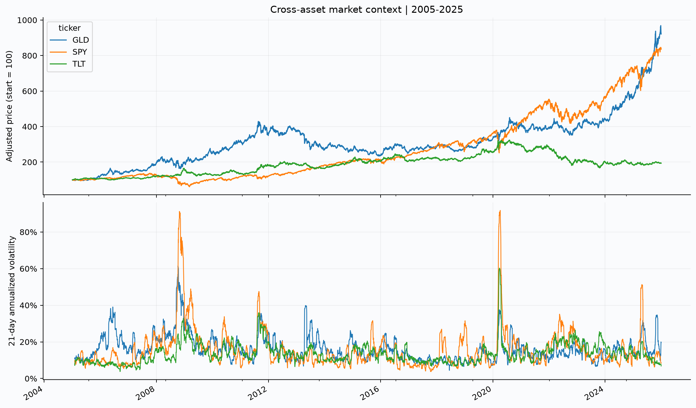
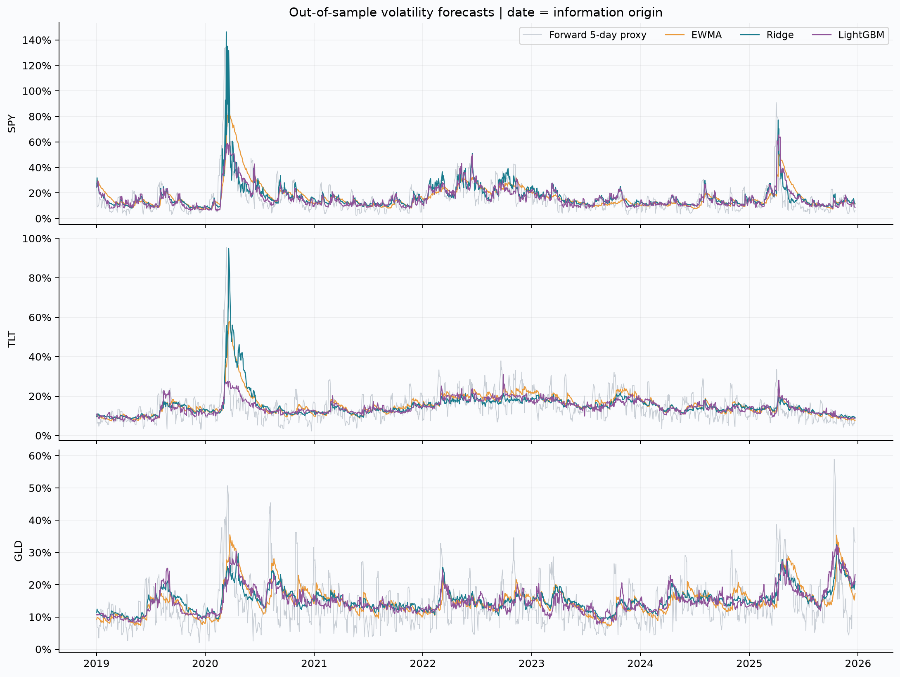
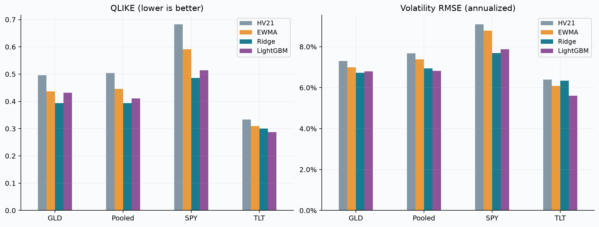
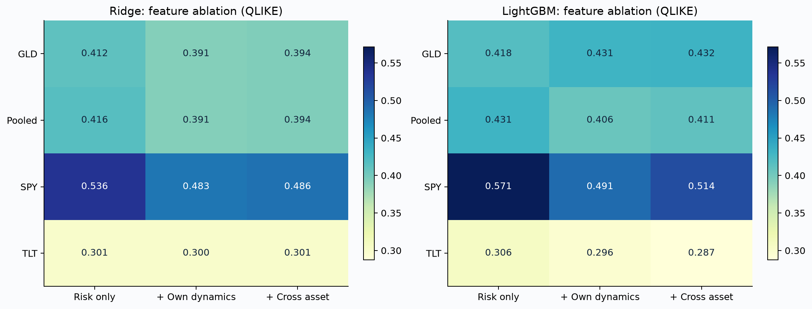
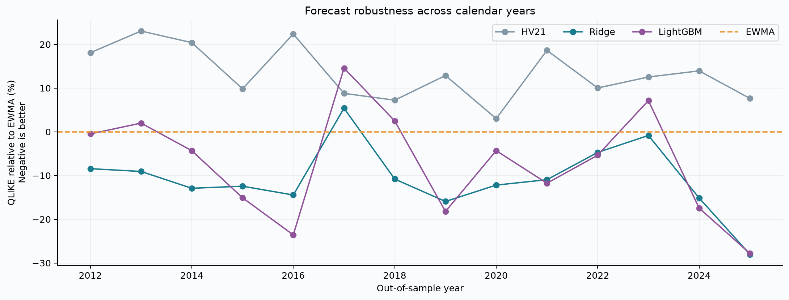
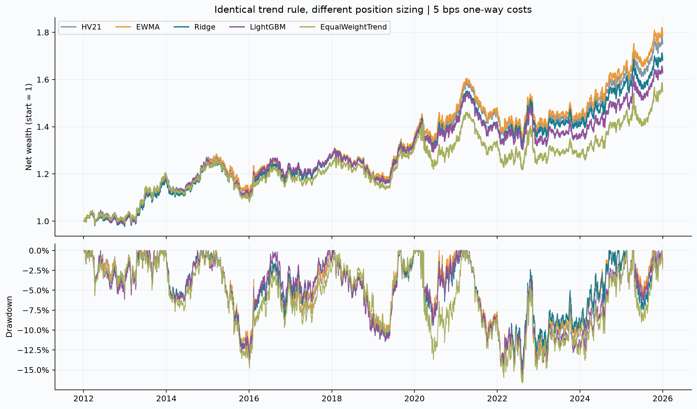
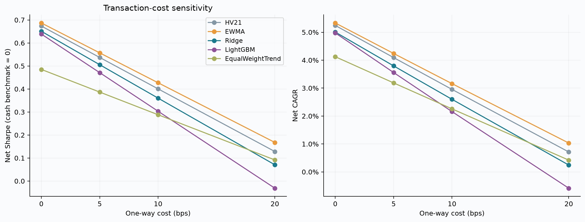
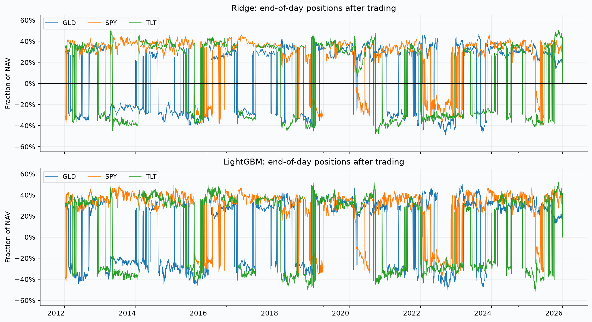
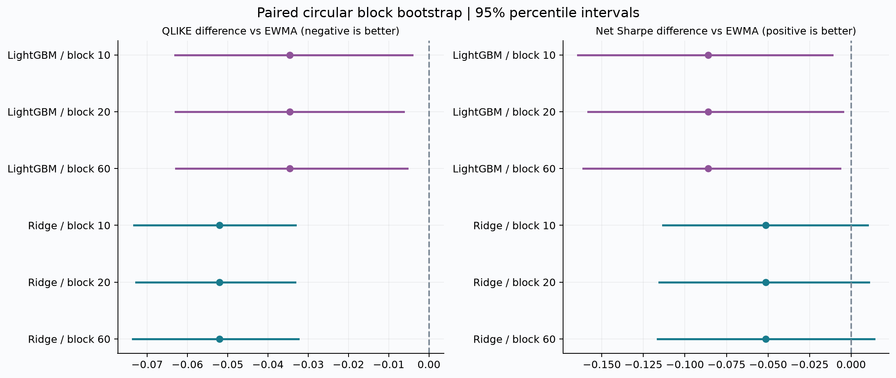

# Machine Learning for Cross-Asset Volatility Forecasting and Portfolio Allocation

A reproducible research project testing whether better volatility forecasts lead
to better portfolio decisions. Daily SPY, TLT and GLD data; Ridge and LightGBM;
historical-volatility and EWMA benchmarks; purged walk-forward validation;
transaction costs, feature ablations and paired block-bootstrap inference.

[Reproduce](#reproduce) · [Data notes](#data-provenance) ·
[Implementation details](#implementation-contract)

## What the experiment found

2005–2025 price history; 14 annual out-of-sample folds from 2012 through 2025;
3,514 common forecast origins per asset. The forecast target is five-day
annualized variance after a one-day execution delay.

| Method (ML: full features) | Pooled QLIKE ↓ | Improvement vs EWMA | Net Sharpe¹ | Max drawdown¹ | Annual turnover¹ |
|---|---:|---:|---:|---:|---:|
| HV21 | 0.5041 | −13.13% | 0.537 | −16.17% | 22.00× |
| EWMA | 0.4456 | — | **0.557** | −15.74% | **20.83×** |
| Ridge | **0.3936** | **11.67%** | 0.506 | **−14.86%** | 23.20× |
| LightGBM | 0.4110 | 7.76% | 0.471 | −15.55% | 27.20× |

¹ Same 126-day trend signal, 5 bps one-way transaction costs, 50 bps annual short
borrow cost, zero cash-return benchmark. Turnover sums absolute traded notional
and is not divided by two. All forecasts share the same dates.

Both ML methods improve QLIKE relative to EWMA under the primary 20-day paired
block bootstrap (Holm-adjusted p = 0.0010 and 0.0180). **Neither improves the
strategy's net Sharpe.** Ridge's Sharpe-difference interval includes zero;
LightGBM's is below zero. Adding other assets' features also does not improve
pooled QLIKE over the own-asset feature set in this experiment. These results
separate statistical forecast accuracy from economic value.

## Reproduce

Python 3.13 is the recorded environment. Run commands from the repository root.
The first run requires internet access; later runs can use the verified cache.

```bash
python3 -m venv .venv
source .venv/bin/activate
python -m pip install -r requirements-lock.txt
python -m pip install -e . --no-deps

# macOS only, if LightGBM cannot load its OpenMP runtime:
# brew install libomp

crossvol run                       # download, fit, backtest, infer, plot, report
crossvol run --offline             # rerun from the same SHA-256-verified snapshot
crossvol run --offline --reuse-forecasts  # checked code/config/data/output hashes
crossvol report                    # refresh figures and the research section in README
pytest -q
ruff check src tests scripts
python scripts/verify_artifacts.py  # verify source/data/output hashes and accounting
```

The complete default experiment took about 45 seconds on the development
machine; runtime depends on hardware. Models use one LightGBM thread. The exact
dependency versions, source hashes, configuration and input/output hashes are in
[the run manifest](artifacts/run_manifest.json). Re-downloading provider data may
return revisions; preserve the local snapshot and its metadata for identical
inputs. `--refresh` explicitly replaces the snapshot.

## Research design

- **Timing:** features observed at close `t`; orders execute at close `t+1`;
  returns begin at `t+2`. The label uses squared log returns `t+2 … t+6`.
- **Validation:** annually expanding outer training; two chronological 126-day
  inner validation blocks; label-end purging at every boundary. Three fixed
  candidate configurations per model, no test-period model selection.
- **Features:** historical risk (4), own-asset dynamics (14), cross-asset inputs
  (20 active features). Self cross channels are zero, avoiding duplicated Ridge
  predictors in the ablation.
- **Models:** separate asset-specific Ridge and LightGBM log-variance models with
  training-only smearing; fixed HV21 and EWMA benchmarks. Full models remain the
  primary comparison regardless of ablation outcomes.
- **Portfolio:** common trend direction, inverse-volatility sizing, asset/gross
  limits, drift-aware turnover, self-financing transaction costs, borrow charges,
  entry fees and final liquidation. Equal-weight trend is an additional control.
- **Inference:** synchronized circular blocks across dates, assets and methods;
  2,000 replicates at block lengths 10/20/60; paired loss and Sharpe differences;
  Holm correction for the two primary forecast comparisons per block length.

## Repository map

```text
configs/default.yaml          Frozen research parameters
src/crossvol/
  data.py                     Download, validate and hash adjusted prices
  features.py                 Causal features and delayed forward labels
  walkforward.py              Nested tuning, purging and annual forecasts
  portfolio.py                Self-financing daily portfolio accounting
  statistics.py               Metrics and paired block-bootstrap inference
  plots.py                    Nine figures, PNG and SVG
  report.py                   Refresh the generated research section in README
  cli.py                      Reproducible command-line workflow
tests/                        Offline synthetic integrity and regression tests
artifacts/
  figures/                    Market, forecast, ablation, strategy and inference plots
  tables/                     Metrics, inference and locally generated audit tables
  run_manifest.json           Configuration, versions and hashes
README.md                     Project guide, full research report and career notes
scripts/verify_artifacts.py   Verify source/data/result hashes and accounting identities
```

Raw provider prices and large daily/audit CSVs are kept locally and excluded
from Git. The smaller summary tables and figures are included for review.
Running the pipeline regenerates `predictions.csv`, `folds.csv`, `tuning.csv`,
`importance.csv`, `daily.csv` and `weights.csv`. The [data notes](#data-provenance)
explain cache integrity and provider-data redistribution.

## Interpretation limits

The ETF universe is small and chosen retrospectively. Adjusted Yahoo prices are
not point-in-time data or executable quotes. Squared daily returns are a noisy
volatility proxy. The 10% risk budget is not a guaranteed portfolio volatility
target; the allocation omits covariance modeling. Cash earns zero and Sharpe
does not subtract a historical risk-free series. Borrow availability, margin
rules, market impact, capacity and taxes are not modeled. Bootstrap inference
is conditional on fitted forecasts and does not absorb all research selection.
The rolling test years have been examined; there is no untouched final holdout.

Code is [MIT-licensed](LICENSE); third-party data is not covered by that license.

`crossvol run` and `crossvol report` update only the marked research section
below. The project overview and appendices remain editable and are preserved.
Do not remove the generated-section markers.

<!-- BEGIN GENERATED RESEARCH -->

<a id="research-report"></a>

## Research report

**Independent quantitative research project | Historical out-of-sample study completed | Research version v0.1**

This report was generated by `crossvol run` from the CSV results. Rerun the full experiment after changing data or parameters; do not enter performance figures by hand. Generated at: 2026-09-24T07:42:57.530409+00:00. The study tests whether machine learning improves cross-asset volatility forecasts and whether those forecasts improve position sizing under a common trend signal. All results are historical simulations.

### 1. Main findings

- **Ridge full**: pooled QLIKE of 0.3936, 11.67% lower than EWMA; Holm-adjusted p=0.0010 at the primary block length. Net Sharpe at 5 bps is 0.506, a difference of -0.051 from EWMA, with a 95% CI of [-0.115, 0.011].
- **LightGBM full**: pooled QLIKE of 0.4110, 7.76% lower than EWMA; Holm-adjusted p=0.0180 at the primary block length. Net Sharpe at 5 bps is 0.471, a difference of -0.086 from EWMA, with a 95% CI of [-0.158, -0.005].

Both ML models improve QLIKE relative to EWMA in the prespecified primary comparisons, passing the Holm-adjusted test at the 5% level. Ridge's Sharpe-difference interval includes zero, so the results do not establish an improvement over EWMA. LightGBM's interval lies below zero, indicating a lower Sharpe under the conditions tested.

The project provides an auditable out-of-sample workflow: market data, strict timing rules, benchmarks, limited tuning, feature ablations, position accounting and inference that accounts for dependence. Forecast errors, portfolio returns and statistical significance are reported separately, without assuming that a more complex model will perform better.

### 2. Data and reproducibility

| Item | Setting |
|---|---|
| Assets | SPY (US equities), TLT (long-term US Treasuries), GLD (gold) |
| Source data | Daily Yahoo Finance OHLCV downloaded with yfinance; auto_adjust=True, repair=False |
| Price history | 2005-01-03 to 2025-12-31; 5,283 trading days, 15,849 rows |
| Out-of-sample forecast origins | 2012-01-03 to 2025-12-22; 3,514 common origins |
| Portfolio backtest dates | 2012-01-03 to 2025-12-31 (the initial all-cash observation is excluded when calculating return moments) |
| Outer / inner validation | 14 annual outer folds; 2 validation blocks of 126 days per fold |
| Download time (UTC) | 2026-09-24T04:51:46.081598+00:00 |
| Random seed / annualization factor | 42 / 252 |
| Data quality | 0 missing observations on common trading dates, 0 duplicates, 0 zero-volume observations |

There are 2 gaps of more than 4 calendar days between consecutive observations. Weekends, holidays and market closures are not filled with zero returns. Checks also cover positive OHLC prices, valid price bounds, common dates and unusual daily returns. No simulated data replaces market observations.

Data SHA-256: `9c25d50739b325ed69f660fef286de0ae9c2f00d399806ac20d46cd84ea8f3eb`. Full download parameters are in [data_manifest.json](artifacts/data_manifest.json); configuration, package versions, source hashes and result hashes are in [run_manifest.json](artifacts/run_manifest.json). The cache is checked against its hash before use. Replacing it with revised online data requires an explicit `--refresh`. Even the first run reads the saved snapshot to avoid differences caused by serialization.

Returns use prices adjusted for splits and dividends. Adjusted prices approximate total returns and do not represent executable quotes on each date. The total-return calculation also reflects the dividend burden on short positions. The Yahoo snapshot does not preserve historical data vintages, so it cannot eliminate all effects of provider revisions. See the [official yfinance documentation](https://ranaroussi.github.io/yfinance/reference/api/yfinance.download.html) for download parameters.



### 3. Forecast target and execution timing

Let $P_{i,t}$ be the adjusted closing price of asset $i$ on trading day $t$, and $r_{i,t}=\log(P_{i,t}/P_{i,t-1})$. Features and forecasts are formed after the close on $t$. Orders execute at the close on $t+1$, and the new positions start earning close-to-close returns on $t+2$.

The defaults are $h=5$ and an execution delay of $d=1$:

$$y_{i,t} = \frac{252}{5}\sum_{k=2}^{6}r_{i,t+k}^2,\qquad \sigma^{realized}_{i,t}=\sqrt{y_{i,t}}.$$

The target is a **volatility proxy based on squared daily returns** over the next 5 trading days, without subtracting the sample mean. It is neither high-frequency realized variance nor a directly observed conditional variance. The label requires the price at $t+6$, so `label_end=t+6`. The last 6 forecast origins have incomplete labels and are excluded from forecast scoring.


```mermaid
flowchart LR
  A[Close t: features and forecast] --> B[Close t+1: execute target]
  B --> C[Returns t+2 through t+6]
  C --> D[Close t+6: target fully observable]
```

Features use only data available at or before the forecast origin. Filtering training data by feature timestamps alone is insufficient: training also requires `label_end < next_boundary`. Portfolio NAV is updated using simple returns, $P_t/P_{t-1}-1$, rather than log returns.

### 4. Features, models and tuning

| Feature set | Active features | Contents |
|:----------|--------:|:----------------------------------------------|
| risk_only |       4 | log RV(5/21/63), log EWMA |
| no_cross  |      14 | risk_only + own-asset returns, downside risk, volatility changes, drawdown and Parkinson range volatility |
| full      |      20 | no_cross + 3 inputs from each of the other two assets: log RV21, 5-day return and 63-day correlation |

The additional no_cross features are cumulative log returns over 1/5/21/63 days, the current absolute daily return, log mean squared downside returns over 21 days, RV5/RV63, the 21-day standard deviation of the 21-day historical volatility series, 63-day drawdown, and log 21-day Parkinson high-low range volatility. All definitions are in [features.py](src/crossvol/features.py).

The full feature set uses a shared 23-column schema. The 3 cross-asset columns corresponding to the asset being forecast are set to zero, leaving 20 active features per model. This prevents duplicate predictors from changing Ridge's effective L2 penalty and makes the full/no_cross comparison better reflect the information added by other assets. Each feature set selects hyperparameters within the inner validation loop. The comparison measures the difference between the two controlled training procedures; it does not identify the causal contribution of any single feature.

| Model | Target and settings | Hyperparameter candidates |
|---|---|---|
| HV21 | Mean squared return over the past 21 days ×252 | Fixed 21-day window; no out-of-sample tuning |
| EWMA | $v_t=0.94v_{t-1}+0.06r_t^2$, annualized to forecast future variance; at least 63 warmup days | Fixed λ=0.94 |
| Ridge | StandardScaler + L2 linear regression on log variance | α=[0.1, 10.0, 1000.0] |
| LightGBM | Shallow gradient-boosted trees fitted to log variance with squared-error loss; learning_rate=0.05 | 3 fixed configurations, shown below |

|   n_estimators |   num_leaves |   min_child_samples |   reg_lambda |
|---------------:|-------------:|--------------------:|-------------:|
|       100.0000 |       7.0000 |             40.0000 |       1.0000 |
|       200.0000 |       7.0000 |             80.0000 |       5.0000 |
|       150.0000 |      15.0000 |             80.0000 |      10.0000 |

Models are fitted separately for each asset. Cross-asset modeling here means using the other assets' risk conditions as inputs; observations from the three ETFs are not randomly pooled. Both ML models use the same number of candidates and validation periods. There is no large parameter search or early stopping on test data. Ridge's scaler is fitted only on each training fold. LightGBM uses a fixed seed, one thread, `deterministic=True` and `force_col_wise=True`. Results may still differ across platforms or library versions; see the [official LightGBM parameters](https://lightgbm.readthedocs.io/en/stable/Parameters.html).

Log predictions are converted back to variance using a smearing factor from training residuals:

$$\widehat y_t=\exp(\widehat f(X_t))\times\frac1n\sum_{j\in train}\exp(\log y_j-\widehat f(X_j)).$$

The factor is estimated from the current fit's training residuals, without validation or test labels. Global smearing is an approximate bias correction and does not ensure calibration in every conditional state. In-sample tree residuals may understate the out-of-sample residual distribution. All predictions are clipped to $[10^{-8},4]$ in annualized variance. These fixed numerical safeguards are not selected from test results.

### 5. Nested walk-forward validation and leakage checks

Models are retuned and refitted at the start of each year. Parameters remain fixed during that year, while forecasts use the features available on each date. The training history expands annually. Test labels from earlier years can enter later training sets once they are fully observed. The first outer training window covers origins from 2005-04-05 to 2011-12-21. Its latest label ends on 2011-12-30, strictly before the test period starts on 2012-01-03.

1. At each test-year boundary $T$, training samples must have an origin $<T$ and `label_end < T`.
2. Construct 2 chronological validation blocks of 126 days from the available history. Purge overlapping labels at each training/validation boundary. Validation labels must also end before the next block or test boundary. With the default settings, this removes the 6 origins immediately before each boundary.
3. Score each candidate by QLIKE on all validation blocks and choose the lowest equally weighted mean. Outer test results play no part in selection.
4. Refit the selected configuration on all training data available at that time and forecast the test year. Save every candidate, training and validation window, selected parameters and smearing factor.
5. Use the same valid forecast dates for all models, assets and ablations. The run produces 84,336 predictions, 252 outer ML fits and 1512 candidate/validation audit records.

Each row of `folds.csv` and `tuning.csv` can be checked for `train_max_label_end < validation_start/test_start`. The design follows the [chronological ordering and gap principles in scikit-learn's time-series validation](https://scikit-learn.org/stable/modules/generated/sklearn.model_selection.TimeSeriesSplit.html), with explicit purging by label end date.

Here, **out of sample means later in time than the data used for each model fit**. The researcher has examined the full output. The years 2023–2025 are part of the rolling experiment and are not an untouched final holdout. Trying further methods adds researcher selection bias; confirmation should use a new future period set aside in advance.

### 6. Forecast scores and results

The main score is QLIKE for variance:

$$L(y,\widehat y)=\frac{y}{\widehat y}-\log\left(\frac{y}{\widehat y}\right)-1.$$

Lower is better. The report also includes RMSE/MAE for annualized volatility and the calibration ratio `mean(target variance)/mean(predicted variance)`, whose ideal value is 1. Pooled scores weight assets equally within each date, then weight dates equally. The three asset rows per date do not count as independent observations. The choice of QLIKE follows [Patton (2011), on forecast comparisons with noisy volatility proxies](https://public.econ.duke.edu/~ap172/Patton_robust_JoE_forthcoming.pdf). Its robustness depends on assumptions about the proxy and conditioning information; it does not automatically give an unbiased ranking against true latent volatility.

| ticker   | model    |   qlike |   vol_rmse |   vol_mae |   calibration |
|:---------|:---------|--------:|-----------:|----------:|--------------:|
| GLD      | EWMA     |  0.4365 |     0.0700 |    0.0500 |        0.9977 |
| SPY      | EWMA     |  0.5911 |     0.0879 |    0.0564 |        0.9936 |
| TLT      | EWMA     |  0.3091 |     0.0609 |    0.0411 |        0.9916 |
| Pooled   | EWMA     |  0.4456 |     0.0738 |    0.0492 |        0.9943 |
| GLD      | HV21     |  0.4963 |     0.0731 |    0.0517 |        0.9978 |
| SPY      | HV21     |  0.6826 |     0.0909 |    0.0568 |        0.9970 |
| TLT      | HV21     |  0.3333 |     0.0639 |    0.0420 |        0.9944 |
| Pooled   | HV21     |  0.5041 |     0.0768 |    0.0502 |        0.9965 |
| GLD      | LightGBM |  0.4318 |     0.0679 |    0.0501 |        0.9907 |
| SPY      | LightGBM |  0.5137 |     0.0788 |    0.0512 |        1.0856 |
| TLT      | LightGBM |  0.2875 |     0.0560 |    0.0386 |        1.1292 |
| Pooled   | LightGBM |  0.4110 |     0.0682 |    0.0466 |        1.0645 |
| GLD      | Ridge    |  0.3938 |     0.0673 |    0.0501 |        0.9687 |
| SPY      | Ridge    |  0.4864 |     0.0769 |    0.0512 |        0.9574 |
| TLT      | Ridge    |  0.3006 |     0.0634 |    0.0416 |        0.9822 |
| Pooled   | Ridge    |  0.3936 |     0.0694 |    0.0477 |        0.9682 |

RMSE/MAE use annualized volatility in decimal form: 0.01=1 percentage point. The forecast chart starts in 2019 for readability; the metrics use the full out-of-sample period.





### 7. Feature ablation and stability across years

| model    | feature_set   |   qlike |   vol_rmse |   calibration |
|:---------|:--------------|--------:|-----------:|--------------:|
| LightGBM | full          |  0.4110 |     0.0682 |        1.0645 |
| LightGBM | no_cross      |  0.4059 |     0.0681 |        1.0391 |
| LightGBM | risk_only     |  0.4315 |     0.0726 |        0.9639 |
| Ridge    | full          |  0.3936 |     0.0694 |        0.9682 |
| Ridge    | no_cross      |  0.3912 |     0.0698 |        0.9687 |
| Ridge    | risk_only     |  0.4163 |     0.0719 |        0.9551 |

For Ridge, QLIKE changes by +0.60% with full features relative to no_cross. For LightGBM, the change is +1.26%. Both models have their lowest point estimate with no_cross among the three feature sets. These are descriptive comparisons over the full out-of-sample period. The full feature set remains the primary model specification. No significance claims are made with multiple-testing adjustment across all ablation comparisons. Training-period feature importance is saved in `importance.csv`: absolute standardized coefficients for Ridge and gain for LightGBM. Neither provides a causal explanation or additional out-of-sample evidence.





The annual chart and [yearly_forecast_metrics.csv](artifacts/tables/yearly_forecast_metrics.csv) help check whether a few years drive the averages. The pandemic, inflation and interest-rate changes provide context; they were not used to select favorable years after seeing the results.

### 8. Trend strategy and position accounting

Trend direction follows a fixed rule: $s_{i,t}=\operatorname{sign}(P_{i,t}/P_{i,t-126}-1)$. This isolates the role of volatility forecasts in position sizing. No model is trained to predict return direction. The rule draws on time-series trend ideas, but does not replicate the 12-month futures strategy in [Moskowitz, Ooi & Pedersen (2012)](https://www.aqr.com/Insights/Research/Journal-Article/Time-Series-Momentum).

$$\widetilde w_{i,t}=s_{i,t}\frac{0.10}{\sqrt{3}\max(\widehat\sigma_{i,t},0.05)}.$$

Each asset weight is first capped at ±60%. Weights are then scaled proportionally to keep gross exposure at or below 100%. The 10% parameter sets equal risk budgets while ignoring correlations. Weight caps and correlations mean that **actual portfolio volatility is not guaranteed to be 10%**. Caps apply at execution; price movements can push weights past them between trades and during the final holding period. EqualWeightTrend uses the same trend direction, with an absolute weight of 1/3 per asset when its signal is nonzero and no position when its signal is exactly zero. It serves as a control without dynamic volatility forecasts.

The five-day average variance forecast acts as a smoothed risk estimate for daily position sizing. It has not been validated as a forecast of next-day conditional variance. Each day, profit and loss are recorded on actual holdings before trades are executed. Trades equal the difference between target holdings and **holdings after price drift**. To avoid implicit leverage from investing all available funds before deducting fees, the backtest solves this self-financing equation for the post-fee NAV ratio $z$:

$$z=1-c\sum_i|z w_i^*-w_i^-|,$$

Here, $w^-$ is measured against pre-trade NAV, $w^*$ against post-trade NAV, and $c=\mathrm{bps}/10000$. Fees apply to both initial entry and final liquidation. One-way turnover is the sum of absolute amounts bought and sold divided by pre-trade NAV, with no division by 2. Short positions incur an annual borrow fee of 50 bps, accrued daily on the previous day's short notional. Cash earns 0; no observed risk-free rate series is used. Sharpe ratios in this report are net of fees and use zero cash return as the benchmark.

The final forecast origin is 2025-12-22. Its target positions are executed after a one-day delay. No further forecasts or rebalancing trades are added. Holdings drift with prices until the final label endpoint, then are liquidated. Price returns continue during this final period, but forecasts with incomplete labels are excluded from scoring.

Net returns include gains and losses from total-return prices, borrow fees and transaction fees. Default transaction cost scenarios are [0, 5, 10, 20] bps; **0 bps means zero transaction fees, with borrow fees still charged**. The backtest does not separately model market impact that varies with portfolio size, taxes and levies, nonlinear ETF trading costs, short availability or separate margin accounts. Adjusted closes and constant costs are research assumptions, not an execution simulation.

### 9. Portfolio performance, costs and subperiod results

Baseline: 5 bps one-way transaction fees + 50 bps annual borrow fees.

| model            | CAGR   | Annualized volatility   |   Net Sharpe | Max drawdown    |   Annual one-way turnover (×) | Average gross exposure   |
|:-----------------|:-------|:-------|-----------:|:--------|-----------:|:--------|
| HV21             | 4.09%  | 8.08%  |      0.537 | -16.17% |     21.998 | 97.98%  |
| EWMA             | 4.24%  | 8.04%  |      0.557 | -15.74% |     20.834 | 97.89%  |
| Ridge            | 3.79%  | 8.00%  |      0.506 | -14.86% |     23.199 | 98.25%  |
| LightGBM         | 3.56%  | 8.12%  |      0.471 | -15.55% |     27.203 | 98.51%  |
| EqualWeightTrend | 3.19%  | 9.21%  |      0.387 | -16.66% |     18.100 | 99.95%  |

CAGR uses 252 trading days per year. Sharpe is mean daily net return / daily return standard deviation ×√252. Maximum drawdown is measured from the previous NAV peak. Annual one-way turnover is expressed as a multiple of NAV and includes entry and liquidation. In the CSV, `total_cost` sums daily normalized cost drag; it does not measure the loss in terminal wealth. All scenarios are in [portfolio_metrics.csv](artifacts/tables/portfolio_metrics.csv).





The table below shows net Sharpe for fixed, consecutive subperiods. It retains positions from the full backtest, with no extra liquidation at subperiod boundaries or separate parameter tuning.

| model            |   2012–2016 |   2017–2021 |   2022–2025 |
|:-----------------|------------:|------------:|------------:|
| EWMA             |       0.563 |       0.553 |       0.561 |
| EqualWeightTrend |       0.480 |       0.288 |       0.412 |
| HV21             |       0.557 |       0.531 |       0.528 |
| LightGBM         |       0.572 |       0.412 |       0.431 |
| Ridge            |       0.534 |       0.473 |       0.515 |



### 10. Block-bootstrap inference with time dependence

Overlapping 5-day labels create serial correlation in forecast losses. Assets are also correlated within each date. The study uses a **paired circular block bootstrap**: sample consecutive blocks from the common dates, allowing blocks to wrap around the end. All assets and models share the sampled dates. Losses are averaged equally across assets before models are compared; assets are not resampled independently. See the [arch documentation on time-series bootstraps](https://arch.readthedocs.io/en/stable/bootstrap/timeseries-bootstraps.html) for background. This repository implements the method directly in NumPy.

The bootstrap uses 2,000 resamples and block lengths of [10, 20, 60], with 20 specified as the primary length. The forecast comparison statistic is `mean(QLIKE_model − QLIKE_EWMA)`; negative values favor the model. The results include 95% percentile CIs. Two-sided p-values use the bootstrap distribution centered under the null. Within each block length, Holm adjustment covers the two comparisons, Ridge and LightGBM against EWMA. Other block lengths assess robustness and cannot be selected after the fact for significance. The CIs are not simultaneous confidence intervals.

| model    |   block_length |   estimate |   ci_low |   ci_high |   p_value |   p_holm |
|:---------|---------------:|-----------:|---------:|----------:|----------:|---------:|
| Ridge    |             10 |    -0.0520 |  -0.0733 |   -0.0331 |    0.0005 |   0.0010 |
| LightGBM |             10 |    -0.0346 |  -0.0631 |   -0.0041 |    0.0230 |   0.0230 |
| Ridge    |             20 |    -0.0520 |  -0.0727 |   -0.0332 |    0.0005 |   0.0010 |
| LightGBM |             20 |    -0.0346 |  -0.0629 |   -0.0063 |    0.0180 |   0.0180 |
| Ridge    |             60 |    -0.0520 |  -0.0736 |   -0.0324 |    0.0005 |   0.0010 |
| LightGBM |             60 |    -0.0346 |  -0.0629 |   -0.0054 |    0.0190 |   0.0190 |

Strategy inference resamples paired dates of net returns at 5 bps, excludes the artificial all-cash starting point, and recalculates Sharpe_model − Sharpe_EWMA. The results include percentile CIs. The share of ordinary bootstrap draws above or below zero is not reported as a formal significance p-value.

| model    |   block_length |   estimate |   ci_low |   ci_high |
|:---------|---------------:|-----------:|---------:|----------:|
| Ridge    |             10 |    -0.0514 |  -0.1132 |    0.0099 |
| LightGBM |             10 |    -0.0860 |  -0.1644 |   -0.0113 |
| Ridge    |             20 |    -0.0514 |  -0.1154 |    0.0106 |
| LightGBM |             20 |    -0.0860 |  -0.1582 |   -0.0048 |
| Ridge    |             60 |    -0.0514 |  -0.1165 |    0.0139 |
| LightGBM |             60 |    -0.0860 |  -0.1611 |   -0.0066 |



Block inference only approximates dependence over a limited span. Structural changes over the full sample may violate stationarity. These intervals are conditional on the fitted forecasts, data and rules used here. Models are not retrained during resampling, and the intervals do not capture uncertainty from model selection, data-provider errors or all researcher trials. Holm adjustment covers only the two prespecified main model comparisons above, excluding ablations, individual years and other possible trials.

### 11. Conclusions, limitations and next steps

Both ML models improve QLIKE relative to EWMA in the prespecified primary comparisons, passing the Holm-adjusted test at the 5% level. Ridge's Sharpe-difference interval includes zero, so the results do not establish that it outperforms EWMA. LightGBM's Sharpe-difference interval lies below zero, indicating a lower Sharpe under the conditions tested. Moving from no_cross to full increases QLIKE by +0.60% for Ridge and +1.26% for LightGBM. For both models, no_cross has the lowest point estimate of the three feature sets.

Lower forecast error does not necessarily raise strategy Sharpe. At 5 bps, annual one-way turnover for EWMA / Ridge / LightGBM is 20.83 / 23.20 / 27.20 times, respectively; more complex forecasts do not automatically reduce trading frequency. The 0 bps scenario allows comparison before transaction costs, so costs need not explain every difference. The fixed trend direction, risk-budget caps, changing correlations, and alignment between the forecast and holding horizons can also affect portfolio results. This experiment does not identify their separate causal effects. Model comparisons should consider QLIKE, calibration, stability across assets and years, drawdowns, and returns after costs. The highest equity curve alone is not enough to establish success.

The main limitations are:

- The sample contains only three highly liquid surviving ETFs selected after the fact. Results cannot be generalized to the entire stock, bond and commodity markets. TLT represents long-term Treasury risk and does not cover all Treasury durations.
- Yahoo's adjusted daily data lack point-in-time historical versions and intraday trade details. Squared daily returns are noisy labels. Jumps and overnight information omitted from the high-low range affect the Parkinson feature.
- Parameters update once a year and may lag abrupt changes. Log regression with a global smearing correction does not guarantee conditional calibration. GARCH/HAR are not included as stronger structural benchmarks; HV21/EWMA are the benchmarks used in this version.
- Cash earns 0, and net Sharpe does not subtract the actual daily risk-free rate. Stock-borrow fees are fixed; the model omits margin requirements, borrow availability, market impact and capacity. These simplifications affect return levels and comparisons between strategies with different cash and short exposures.
- The 10% setting is a position-budget parameter. The model does not explicitly estimate portfolio covariance or guarantee a target realized volatility. The transaction-cost and overnight execution models do not replace a realistic order simulation.
- There is no untouched independent final holdout. All current out-of-sample charts and tables have been made public and reviewed. Bootstrap results do not guarantee future profits.

Useful next steps include freezing the experiment plan before testing on a new, unseen period; adding bonds of different durations and more assets; using licensed, traceable historical data vintages and intraday realized variance; comparing HAR/GARCH; calibrating with out-of-time residuals from the training period; incorporating cash rates, realistic stock-borrow fees and market-impact estimates; and testing portfolio risk allocation that accounts for covariance. Test each extension separately, without searching repeatedly until a significant result appears.

### 12. Validation and usage

Tests check for future prices altering past features, misaligned or overlapping labels, test labels affecting model selection, and scalers fitted on test data. They also check model randomness, sample consistency, execution timing, turnover after weight drift, entry and exit costs, short-selling fees, and self-financing portfolio accounting. Inference checks cover duplicated assets treated as independent observations, unpaired bootstrap samples, and inconsistent treatment of the initial Sharpe anchor. Unit tests in continuous integration do not download data.

```bash
python3 -m venv .venv
source .venv/bin/activate
python -m pip install -r requirements-lock.txt
python -m pip install -e . --no-deps
# If LightGBM on macOS lacks OpenMP: brew install libomp
crossvol run                   # Download data and run the full pipeline for the first time
crossvol run --offline         # Use the same data snapshot verified by SHA-256
crossvol run --offline --reuse-forecasts  # Only when code/config/data and forecast file hashes match
crossvol report                # Rebuild figures and this report from existing results
pytest -q
ruff check src tests scripts
python scripts/verify_artifacts.py
```

Raw market data and large daily outputs stay local and are excluded from Git by default. Summary tables, PNG/SVG figures, configuration files, manifests and this report can be shared on GitHub. Data-use and redistribution terms are separate from this repository's code license. Rate limits and data revisions may affect downloads during replication. A fixed local snapshot supports exact reruns on this data. Downloading again reproduces the method, but the provider may return different prices in future downloads.

Key files: [Features](src/crossvol/features.py) · [Walk-forward](src/crossvol/walkforward.py) · [Portfolio accounting](src/crossvol/portfolio.py) · [Statistical inference](src/crossvol/statistics.py) · [CLI](src/crossvol/cli.py).

<!-- END GENERATED RESEARCH -->

<a id="data-provenance"></a>

## Data provenance

The default run downloads daily SPY, TLT and GLD OHLCV from Yahoo Finance through
yfinance, from 2005-01-01 inclusive to 2026-01-01 exclusive. Adjusted OHLC uses
`auto_adjust=True`; `repair=False`. There is no synthetic fallback.

`data/raw/prices.csv` and `data/raw/prices.metadata.json` are a local snapshot and provenance
record. They are deliberately ignored by Git. The first and later runs both read
the serialized CSV. Cache reuse checks request parameters and SHA-256; mismatch
fails with an actionable error. `crossvol run --refresh` explicitly replaces it.
Back up this pair to reproduce the identical price snapshot on another machine.

The public research metadata lives in `artifacts/data_manifest.json`. Raw provider
data is not licensed under the repository's code license. Consult the provider's
terms before redistributing data. Downloading the same dates later may return
revised values, so fresh-download and fixed-snapshot reproducibility differ.

Validation rejects missing assets, unequal dates, duplicates, nonfinite or
nonpositive prices, invalid OHLC bounds, negative volume and extreme daily jumps.
No calendar forward filling is performed. Adjusted data is not a point-in-time
vendor database; the three surviving ETFs are an ex-post chosen universe.

<a id="implementation-contract"></a>

## Implementation contract

This section records the interface and research decisions shared by the implementation modules.

- Config is a nested dict loaded from `configs/default.yaml`.
- Prices: long DataFrame, columns `date,ticker,open,high,low,close,volume`, sorted date/ticker. All OHLC are dividend/split adjusted by yfinance auto_adjust=True. Dates timezone naive.
- Returns for labels/features are adjusted-close log returns. Portfolio earns simple adjusted-close returns.
- Feature origin `t` sees close t. Execution is close t+1; first earned return is t+2. Five-day annualized variance label is 252/5 * sum(log_return[t+2:t+7]**2). `label_end` is t+6. Last 6 rows have missing labels.
- `features.py` implements `features.build_features(prices, config)` returning `(panels, groups)`: `panels` dict ticker -> DataFrame indexed date, all causal features plus `target_var,label_end,hv_var,ewma_var`; `groups` dict `risk_only`, `no_cross`, `full` -> list of feature names. Every asset uses identical names, cross features ticker-specific (e.g. cross_SPY_log_rv21). Each asset's three SELF cross channels are identically zero to avoid duplicate predictors changing Ridge regularization. Thus full has 23 schema columns but 20 active features; no_cross removes ALL cross_ features. Warmup rows may be dropped; unlabeled tail kept.
- Forecast module: `walkforward.run_forecasts(panels, groups, config)` returns dict of DataFrames `predictions, folds, tuning, importance`. Predictions long columns `date,ticker,model,feature_set,pred_var,target_var,label_end,fold`; models HV21,EWMA,Ridge,LightGBM; baselines feature_set=baseline, ML risk_only/no_cross/full. Generate only common labeled OOS dates for honest common sample. Annual expanding outer train, nested 2 chronological validation blocks of 126 origins each; both train and validation label_end strictly before following boundary. Ridge StandardScaler inside training only; models fit log variance, training-residual smearing exp correction (record), fixed 3 candidates each, choose minimum mean QLIKE. Seed42, LGBM deterministic single-thread. No forecast optimization based on outer test. Bounds pred_var=[1e-8,4] shared all forecasts. Record fold train_start/end/max_label_end/test_start/end and params. Feature importances training-derived, not causal evidence.
- `statistics.forecast_metrics(predictions)` returns model/feature_set/ticker and pooled equal-date/asset QLIKE, vol_RMSE, vol_MAE, calibration. QLIKE = y/p-log(y/p)-1.
- Portfolio module: `portfolio.run_portfolios(prices,predictions,config)` returns dict DataFrames `daily,metrics,weights`. Use ONLY baseline and ML full for comparable portfolios plus EqualWeightTrend (same trend direction, 1/3 fixed magnitudes). Generate desired weights on origin t from sign(P_t/P_t-126-1) * 0.1/(sqrt(3)*sqrt(pred_var)); apply floor .05, per-leg .6 and gross1 caps. Shift to execute close t+1, earn starting t+2. Explicit state recursion with drift-aware trade turnover; charge at trade close cost_bps/1e4*sum absolute dollar traded / pretrade NAV; borrow50bps annual on preperiod short notional; cash rate0. Costs include initial entry and final liquidation. First all-cash close before first execute included, all methods identical dates; last forecast executes, earn its 5 label returns then carry last target to final available labeled end (document precise implementation). Metrics columns include model,cost_bps,cagr,ann_vol,sharpe,max_drawdown,annual_turnover,total_cost,avg_gross. Sharpe uses zero cash benchmark. cash/short simplification stated.
- Inference module owns paired CIRCULAR block bootstrap on synchronized dates across assets/model losses and strategy returns, not independent asset sampling. Forecast comparison full Ridge and LightGBM vs EWMA, average daily QLIKE differences candidate-baseline (negative better), bootstrap percentile 95% CI and centered-null two-sided p-value; Holm across two models per block length. Strategy comparison net base5bps Sharpe candidate-EWMA paired block bootstrap percentile95% CI; do not claim a formal p-value from naive resampling; block10,20,60; 2000 replicates. Tests synthetic and meaningful, no network CI.

<a id="career-notes"></a>


**Machine Learning for Cross-Asset Volatility Forecasting and Portfolio Allocation**  
*Independent Research Project — Implemented & Evaluated*

- Built a reproducible SPY/TLT/GLD volatility research pipeline with Ridge and LightGBM, evaluated over 14 annual walk-forward folds and 3,514 out-of-sample forecast dates per asset; reduced pooled QLIKE by 11.7% and 7.8%, respectively, versus EWMA.
- Implemented nested time-based tuning, label-overlap purging, train-only preprocessing, feature ablation and paired block-bootstrap inference with Holm-adjusted forecast comparisons.
- Backtested forecast-sized trend portfolios with delayed execution, drift-aware turnover and 0–20 bps transaction-cost scenarios; found that improved forecast accuracy did not improve net Sharpe over EWMA, identifying the limits of forecast-driven allocation.
